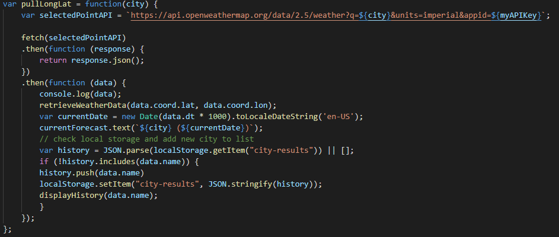

# NBM-Homework-06-WeatherDashboard

USER STORY
-

(SUPPLIED)

AS A traveler

I WANT to see the weather outlook for multiple cities

SO THAT I can plan a trip accordingly

(MY USER STORY)

AS A web developer

I WANT to create a weather dashboard that allows the user to view weather forecasts based on what city they select

SO THAT I can showcase my understanding of server-side-APIs and create a helpful app that I can use for future travel planning.

DEPLOYED APPLICATION
-

PROCESS DESCRIPTION
-

I began this process by first structuring the jumbotron header and the city search/selection sections based on formatting suggestions from various bootstrap guides and stackoverflow forum responses. 

The next step was to create the primary section that displays the current days weather conditions. 

One thing I was not able to implement to accurately match my vision for the main forecast section was to have a larger icon displaying the weather conditions to the right of the weather data.

After filling in the basic p tags for this section, I decided to begin working on the css styling of the page. Since this was an app designed to display weather information, I took inspiration from my mobile phones weather app display as well as the one downloaded on my computer. The end result gave the page a background of a linear gradient that simulates cloud coverage in the lower part of the atmosphere, with clear blue skies above. 

The next styling piece was to use another linear gradient that resembled sunlight breaking through light cloud coverage with the yellow of the sun being projected from the top corner of the section. 

My last piece of initial styling was to find an appropriate emoji to act as the search button for a user's desired city. I found the magnifying glass icon to be the most fitting without drawing too much attention away from the rest of the page. 

Once those steps were completed, I began creating my five cards that would display the next five day's weather outlook. 

This was a challenging build, but with the help of bootstrap guides I was able to get cards to display the called information correctly and cleanly. 

In the future I would like to have the white space of the cards instead show a semi-transparent background of the weather icon, but I am unsure if this can be accomplished with the bootstrap formatting. 

After completing this section, I began to work on my javascript coding. 

The first task to complete was to make sure that my API call of weather data was being pulled correctly. However, this only worked when I had a variable for a current city of "Seattle" to pull the data as a test. 

Once I was able to get the API to call the current weather information, I began to build the code that would present the future weather data for a wide variety of selected cities. 

Finally, I created a function that would save selected cities and present the cities to the user to allow them to switch between different location data. 

The last step was to set a function that would pull weather data on a button click as opposed to populating on page load.

DEPLOYED APPLICATION LINKS
-
[DeployedWeatherDashboard](https://nathanmilburn.github.io/NBM-Homework-06-WeatherDashboard/)
[WeatherDashboardRepository](https://github.com/NathanMilburn/NBM-Homework-06-WeatherDashboard)